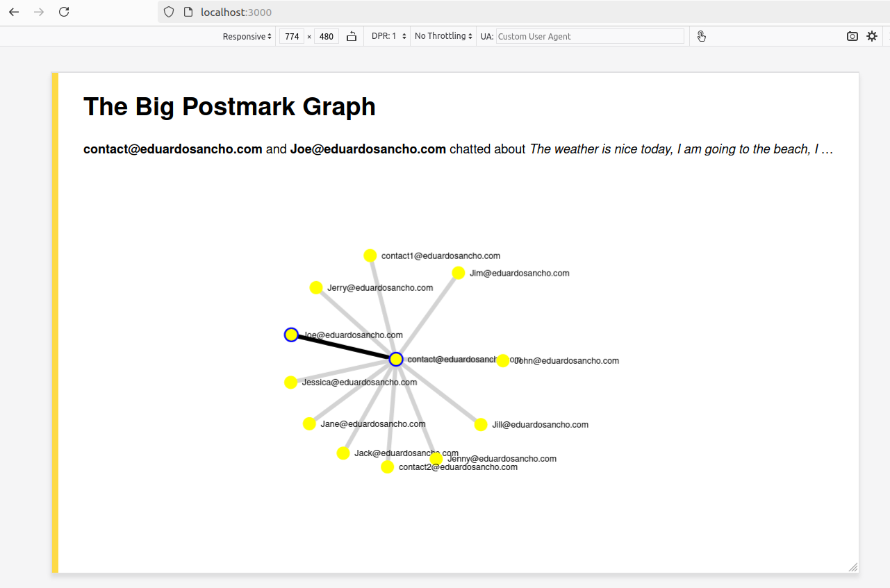

# Awesome Graph with 'Postmark API'

# Table of Contents
- [Setting things up](#setting-things-up)
   - [Running the Rails server](#running-the-rails-server)
   - [Taking the first snapshot](#taking-the-first-snapshot)
- [What should you see?](#what-should-you-see)
   - [Default data](#default-data)
   - [Preview of the awesome graph](#preview-of-the-awesome-graph)
- [Schedule the snapshots to run at midnight with Cron jobs](#schedule-the-snapshots-to-run-at-midnight-with-cron-jobs)

## Setting things up

This repository contains a Rails app with a React frontend. To get started, follow these steps:

* `cp .env-example .env` and update the `.env` file with your Postmark Server API token and your account's domain.
* Install the Ruby version found in [.ruby-version](/.ruby-version) (we like to use [RVM](https://rvm.io)).
* Install [NVM](https://github.com/creationix/nvm).
* Run `nvm install` in the repository root.
* Install [Yarn](https://yarnpkg.com/en/docs/install) (required by Webpacker).
* Depending on your platform, you might need to install libsqlite3 for SQLite support.
* Run `bin/setup`.

To verify that your dev environment is set up correctly, run the Rails server and open [http://localhost:3000/](http://localhost:3000/) in your browser.

``` bash
# Running the Rails server

$ bin/rails server
```

## Taking the first snapshot

Run this Rake task to take the first snapshot of your app.

``` bash
$ bin/rake snapshot:take
```

## What should you see?

You’re given access to a Postmark server ([?](https://postmarkapp.com/support/article/1105-an-introduction-to-postmark-servers)) used by some 3rd party app to send private message notifications to its users (a common use case for Postmark). The test app will build and present the network of communications within the community of the app’s users.

The app’s boilerplate consists of a Rake task `snapshot:take` that takes a (say, nightly) snapshot of all in-app communications, the `Snapshot` model that stores all in-app communications up to the time it was taken, a Rails controller that serves the latest communications snapshot, and a React view that presents this data to the end user.

#### Default data

Until your first snapshot is taken, the component will show the data hard-coded in the `graph.jsx` file. The graph shows a network of in-app communications where each node is a person and each connection is a message from one person to another. When the user highlights a line connecting two users, the inspector component should display the topics the two chatted about. See the screenshot below for an example.

#### Preview of the awesome graph



### Schedule the snapshots to run at midnight with Cron jobs

``` bash
$ whenever --update-crontab

$ crontab -l # verify the changes were saved
```

Cron jobs run at the system level, so don't forget to clear crontab after you're done playing with this project.
``` bash
$ crontab --clear-crontab
```
